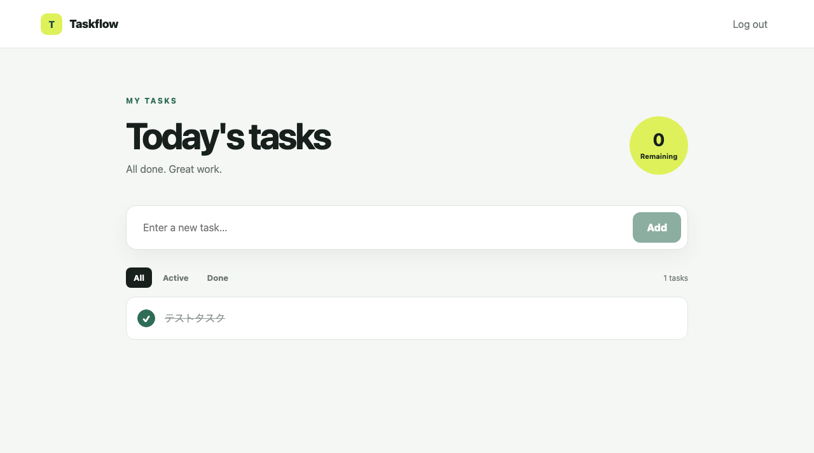

# Taskflow

A single-user task management app built with Next.js, Rust, MySQL, and Redis.

## Getting Started

1. Copy `.env.example` to `.env`.
2. Change `FIXED_PASSWORD` if needed.
3. Run `docker compose up --build`.
4. Open http://localhost:3000.

The initial login password is `taskapp`.

## Structure

- `frontend`: Next.js
- `backend`: Rust / Axum
- `mysql`: Stores tasks persistently
- `redis`: Stores login sessions

## API

- `POST /api/login`
- `POST /api/logout`
- `GET /api/session`
- `GET /api/tasks`
- `POST /api/tasks`
- `PATCH /api/tasks/:id`
- `DELETE /api/tasks/:id`

This authentication approach is intended for initial development only. Before production use, add a user table, password hashing, CSRF protection, and TLS.
